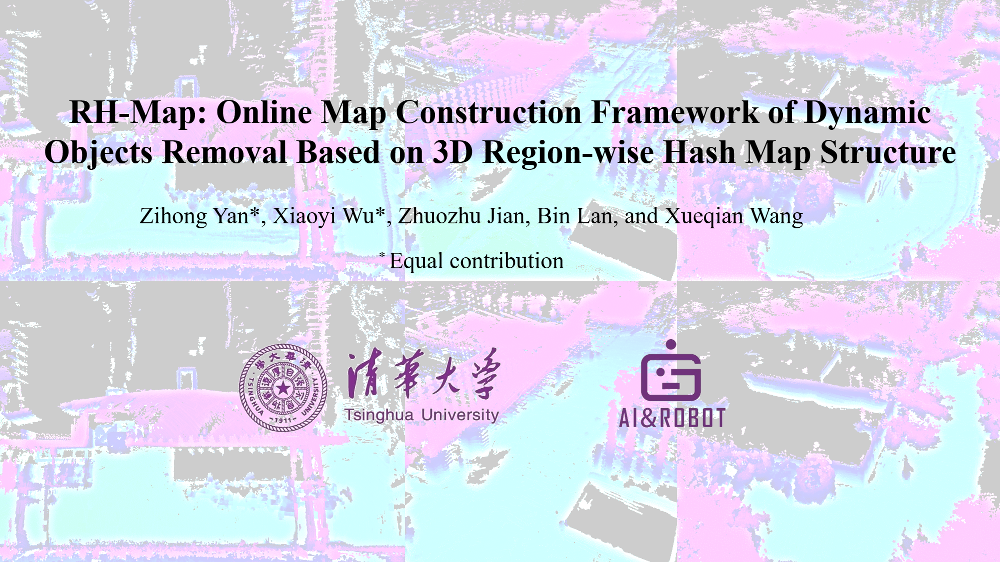
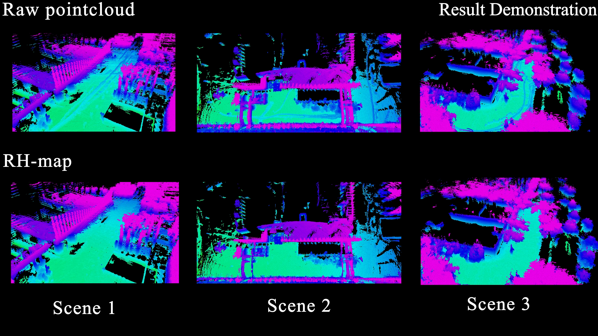
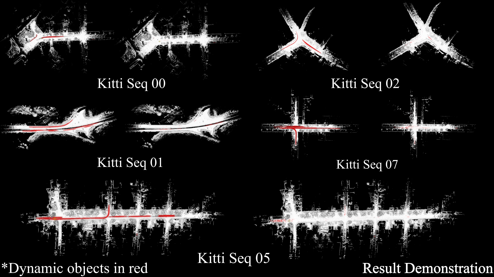
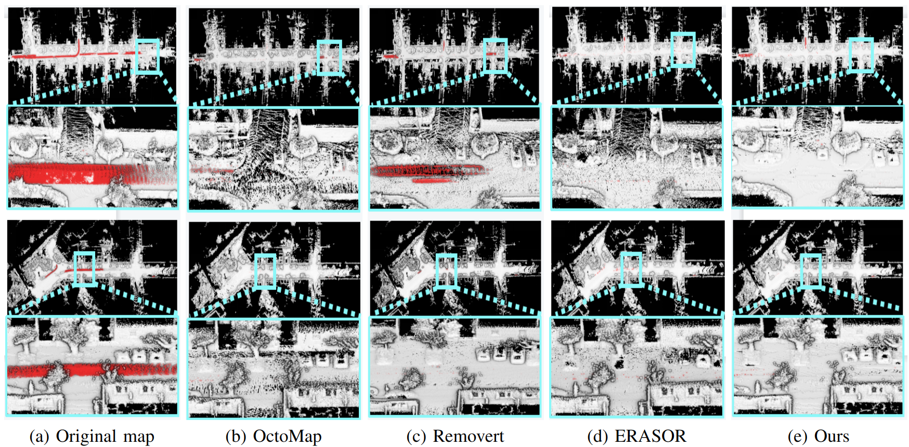

# Dynamic Mapping
All things will be update soon.
## Introduction

The video can be reached on [YouTube](https://www.youtube.com/watch?v=J88xo2M3X6A&t=12s).

### Experiments in real-world

  

### Comparisions on SemanticKITTI
<table>
<tr>
    <th>All Seqs of RH-Map</th>
        <td>

        </td>
</tr>
<tr>
    <th>Comparisions with existing method in details</th>
        <td>

</tr>
</table>

All the pcd results can be reached at [results](https://drive.google.com/drive/folders/1bhhVIdqCIDsI3Jz2mEWbTN1ngprhLmBL?usp=sharing)

### Table of Contents
1. [Introduction](#RH-Map:-Online-Map-Construction-Framework-of-Dynamic-Objects-Removal-Based-on-3D-Region-wise-Hash-Map-Structure)
2. [Publication](#Publication)
3. [Dependencies](#Dependencies)
4. [How to use](#How-to-use)
5. [Application](#Application)
6. [License](#License)

## Application
Integration with PUTN for robot navigation.